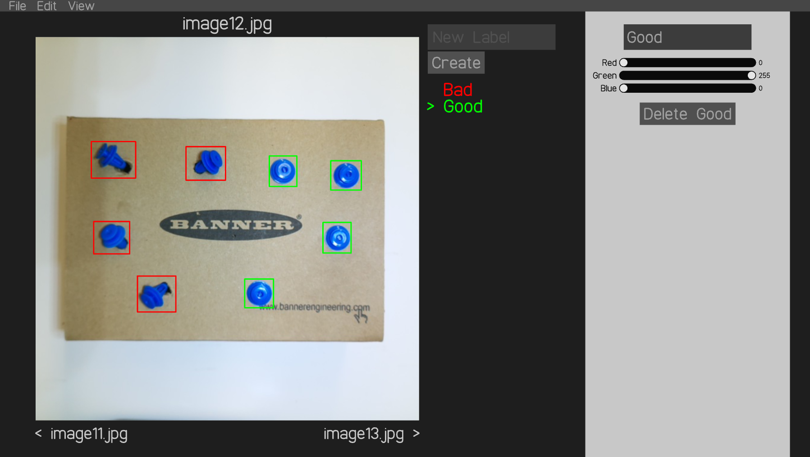

# Label images

A tool for labelling images for object detection models

# How to use

Run the `imageLabel.exe` program. This program is fully portable and can be downloaded and run alone.

To load a dataset, Go to `File -> Import Images`. This will prompt you to select a folder. The folder should contain the dataset which are images of types png, jpg, or bmp.

You can then label the images by clicking and dragging with the mouse.

To export the labels in the YOLO format, go to `File -> Export Label Folder`. You'll be prompted to select a folder. The folder will be filled with many `txt` files with names matching the names of the images.

The YOLO format has one label text file for each image. It has the following format:
```
classID, centerX, centerY, width, height
```

where the `centerX`, `centerY`, `width`, `height` range from 0 to 1.

# lbl files

The imageLabel program supports a custom file type called an `lbl` file. This offers a compact way to save the labels of a dataset in a single file as well as saving the names of the labels. You can save an `lbl` file using `File -> Save lbl`. You can also load an `lbl` file using `File -> Import lbl`. This has the same effect as exporting and importing a label folder.

# Ensure the following about your dataset

- All image are 640x640 (will change)
- All images are RGB formatted (no transparency)

# Images

